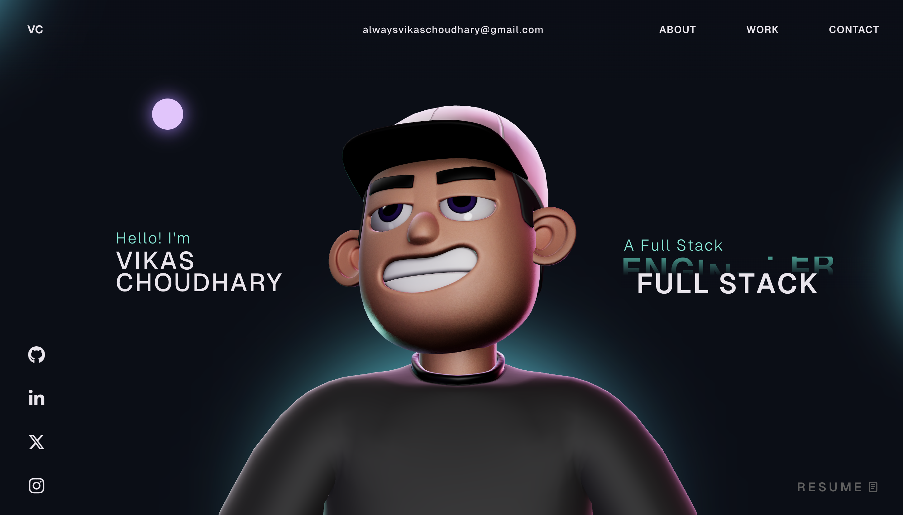

# Vikas Choudhary - Portfolio Website 🚀

This repository contains my personal portfolio website, showcasing my projects, experience, and technical skills as a Full Stack Developer.

## Techstack 🛠️

- **Backend**: Java, Spring Boot, Spring Security, JDBC, JPA, PostgreSQL, MySQL, MongoDB.
- **Frontend**: React, TypeScript, Flutter, Dart, GSAP, ThreeJS, HTML5, CSS3, JavaScript.
- **APIs & Tools**: Google Maps API (Places, Directions, Distance Matrix, Geocoding), Cloudinary, JWT.

## Features ✨

- **3D Tech Stack Visualization**: Interactive 3D spheres representing my core technologies.
- **Responsive Design**: Optimized for all devices.
- **Smooth Navigation**: Powered by GSAP and ScrollSmoother.
- **Project Showcase**: Carousel of my major projects with links to source code.

## Instructions 🛠️

This project uses GSAP Trial plugins for some animations. To host this version, you might need to replace trial plugins with the official GSAP Club plugins if applicable.

---
Designed and Developed by [Vikas Choudhary](https://github.com/alwaysvikaschoudhary)
